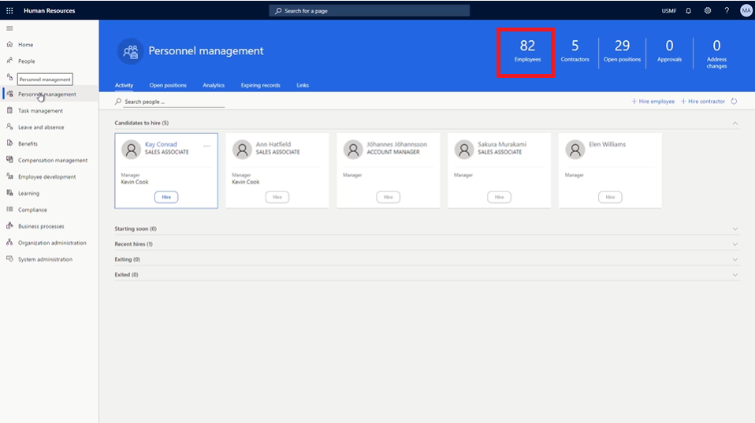

---
demo:
    title: '示範 1： 指派學習課程'
    module: '模組 4： 學習 Microsoft Dynamics 365 Human Resources 的基礎知識'
---

## 示範 1: 指派學習課程

1. 瀏覽置 **Microsoft Dynamics 365 Human Resources** 首頁。  
    在 Microsoft Dynamics 365 Human Resources 中，人事經理可以為員工指派訓練課程。在此範例中，公司的新員工 Alicia 需要被指派在前 30 天內提供給員工的訓練。

1. 在右上方的公司選擇器中，驗證您要連接的公司是 **USMF**。如果不是，請將其變更為 **USMF**。

1. 請在畫面左上角選擇**人事管理**索引標籤。

1. 在**人事管理**頁面右側，請按一下**員工**字樣正上方的數字。

    

1. 在**員工**表中，請選取要指派訓練的員工姓名。例如，**Alicia Thornber**。  
    接下來，請使用專長認證和發展索引標籤來查看有關員工認證、教育和技能資訊的連結。

1. 在員工頁面上，請選取**專長認證和發展**索引標籤。

1. 請在**專長認證**區段選取**課程**。  
    從員工的課程頁面，可以查看是否已指派任何課程。在 Alicia 的案例中，未列出任何課程。要檢視可指派的課程，您需要選擇課程 ID 功能表。

1. 選取**課程 ID** 功能表。

1. 在課程表中，請選取**課程 ID** 功能表。

1. 在**課程 ID** 功能表中，請選取**課程狀態**功能表。

1. 在**課程狀態**功能表中，請選取**課程狀態設定為**方塊。  
    然後，您可能會需要編輯正在應用的**課程 ID** 篩選，例如將篩選變更為僅顯示開啟的課程。

1. 在**課程狀態設定為**方塊中，請輸入**開啟**。

1. 在**課程狀態**功能表中，請選擇**申請**以查看所有可用的公開課程。  
    現在可以將新員工訓練課程指派給 Alicia。

1. 請選取要指派的課程。例如， **00006 新員工訓練**。

1. 在轉移課程資料窗格中，請選取**是**。

1. 在**課程**頁面的**開始日期**欄位中，請選擇**行事曆圖示**。

1. 在行事曆中，選擇開始日期。例如，**2021 年 1 月 5 日**。

1. 在**結束日期**欄位中，請選擇**行事曆圖示**。

1. 在行事曆中，選擇訓練的結束日期。例如， **2021 年 1 月 8 日**。

1. 在**課程**頁面的左側，請選取**儲存**以儲存您的變更。

1. 在**課程**頁面右側，請選取 **X** 來關閉該頁面。  
    如果您需要變更任何已指派的課程，請再次選取課程。

1. 在**員工**頁面上的**專長認證**區段，請選取**課程**。

1. 在**課程**頁面的瀏覽列中，請選擇**編輯**來進行變更。

1. 在**開始日期**欄位中，請選擇**行事曆圖示**。

1. 選擇課程的新開始日期。例如， **2021 年 1 月 6 日**。

1. 選取**儲存**。

1. 選取**X** 圖示來關閉頁面。

1. 在**員工**頁面上，請選取 **X** 圖示來關閉頁面。
