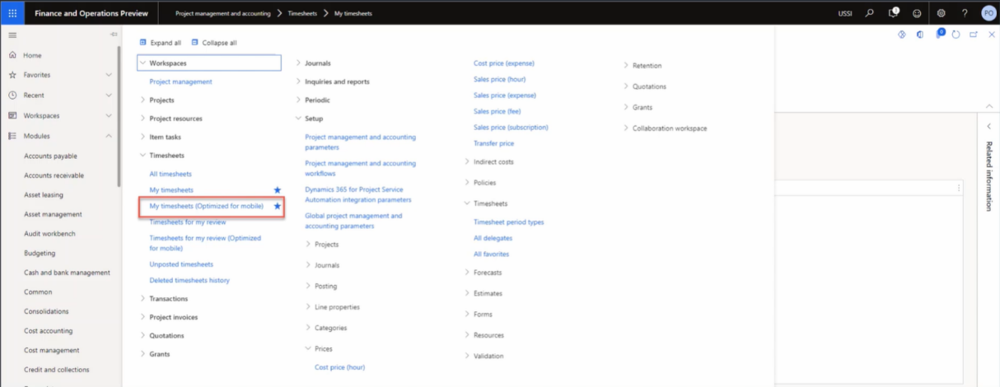

---
demo:
    title: '示範 3： 探索專案成本'
    module: '模組 5： 學習 Microsoft Dynamics 365 Project Operations 的基礎知識'
---

## 示範 3: 探索專案成本

在此示範中，我們將逐步建立 Contoso Consulting 專案的時間和費用項目。我們將了解針對 Web 和行動裝置展示而最佳化的格式項目，並了解如何使用工作流程來管理核准程序。

1. 在 **Dynamics 365 for Finance and Operations** 的瀏覽窗格中，請選擇**模組 > 專案管理和會計 > 時程表 > 我的時程表 (針對行動裝置最佳化)**。  
    首先，我現在雖然不在行動裝置上，但在我們選取選項**我的時程表 (針對行動裝置最佳化)** 後，您會辨識這些表單適用於行動裝置。

      

    這種最佳化是 Microsoft 商務應用程式的一個關鍵獨特性，有助於確保 Web 和行動裝置使用之間的學習曲線最小化。

1. 請在右上方的公司選擇器中，驗證您已連線的法律實體是 **USSI**。如果不是，請將法律實體更改為 **USSI**。

1. 在**我的時程表**頁面上，請選取**新增**。  
    現在我們將根據已配置的設定建立一個新的時程表。

1. 在**新的時程表**窗格中，請指向**日期**方塊。  
    輸入的日期將會決定時程表期間。

1. 請指向**從我的最愛中建立**。  
    如果有已儲存的我的最愛，則可以選擇從它們中建立以節省時間。

1. 完成後，請選取**確定**。

1. 在**我的時程表詳細資料**頁面上，請選取 **新增+** 圖示。

1. 在**新的時程表列窗格**中，請指向**法律實體**方塊。  
    將會開啟新的時程表列，其中包含客戶、專案、類別、該列屬性和稅金參數等詳細資料。如果該時間項目是代表您組織內的另一家公司，您也可以選擇不同的法律實體。

1. 請選取**專案 ID** 功能表。

1. 請選取一個可用專案，例如 **Contoso Consulting** 專案。

1. 完成後，請選取**確定**。  
    時間項目的行動裝置最佳化畫面將會開啟，您可以開始為專案和類別 (在本案例中為**服務**)來預約每天的時間。

1. 在**時間項目**頁面的**週一**方塊中，輸入**8**。  
    這表示該項目一天的時數。

    

1. 在**內部註解**方塊中，新增一個註解。例如：**可能想和他們談談新的腳踏車**。  
    也可以針對專案來輸入內部和外部註解，以確保所有當事人都了解已記錄時間的本質。

1. 在**外部註解**方塊中，新增一個註解。例如：**調整鏈條並對齊車隊的前輪**。

1. 在瀏覽列中，請選取**儲存**。

1. 在左側瀏覽功能表中的**時程表**下，請選取**我的時程表**。

1. 在**我的時程表**頁面上，請選取稍早建立的時間項目。

1. 在**時程表**索引標籤上，請指向類別欄位。  
    現在，假設我們已回到電腦上，並正在從 Web 時程表表單中檢閱我們的時間。我們仍然可以看到相同的資訊，例如類別和時間。

1. 在**明細詳細資料**下，請指向**內部註解**和**外部註解**。  
    我們還可以檢閱我們稍早輸入的註解。那裡一有資訊只是配置格式略有不同。這種格式通常用於最終檢閱，因為人們可以更輕鬆地檢閱和驗證他們的時間，尤其是當有人被指派到多個專案或類別時。

1. 在瀏覽列中，請選取**工作流程**索引標籤。  
    如果我們已滿意該時間表，則可以提交它。每個組織將在實作階段根據各自的公司原則來確定必要的核准。

1. 在**檢閱時程表工作流程**窗格中，請選取**提交**。

1. 在**檢閱時程表工作流程 – 提交**窗格中，新增任何其他註解。

1. 請選取**提交**。

1. 請瀏覽至**時數交易**頁面。如果**時數交易**索引標籤顯示為灰色，請瀏覽至**我的時程表頁面**，然後選擇之前ˋ建立的時程表。

1. 在**時數交易**頁面上，請檢閱該頁面。  
    核准後，該結果將會被張貼並顯示在時數交易頁面中。我們可以看到所有相關資訊，例如法律實體、專案、類別、時間等，而在這種情況下，我們甚至可以檢視成本價格和銷售價格。  

接下來，我們可以深入到憑證交易。

1. 在瀏覽列中，請選取**憑證**。

1. 在**憑證交易**頁面上，請指向**總帳帳戶**和**帳戶名稱**區段。  
    在這些區段中，我們可以看到對一般底帳和及將使用的帳戶的所致的影響。  

現在讓我們為同一個 Contoso 諮詢專案建立一個費用項目。

1. 在瀏覽窗格中，請選取**模組 > 費用管理 > 我的費用 > 費用報表**。

1. 在**費用管理**頁面的**報表**索引標籤上，請選取 **+新增費用報表**。

1. 在**新增費用報表**窗格的**用途方塊**中，輸入一個標題。例如，**Contoso – Feb2021**。

1. 請選取**確定**。

1. 在**費用**頁面上，請選取 **+新增費用**。  
將出現一個新的費用列。

1. 在**費用類別**欄位中，請從下拉式**類別**功能表中選取**燃料**。  
在這裡，我們可以在新的費用輸入其詳細資料。

1. 請在**交易金額**欄位中輸入**25.00**。

1. 請在**貨幣**欄位中選取**美元**。

1. 在**交易日期**欄位中，請選取一個日期。例如，**2/1/2021**。  
    輸入所有詳細資料後則可以節省該費用。

1. 選取**儲存**。

1. 在左側瀏覽功能表中的**工作區**下，請選取**費用管理**。

1. 在**費用管理**頁面，請選取您剛剛建立的費用報表。

1. 在**費用報告**頁面上，請選取**專案 ID** 欄位，然後選取**00000093 Contoso Consulting**。  

接下來，我們可以表示該燃料將被計入 Contoso Consulting 專案中，以及有關費用的其他資訊。

1. 請指向**其他資訊**方塊。

1. 在畫面右下方，請選取**儲存並繼續**。

1. 請在畫面右側選取**提交**。

1. 在**註解**方塊中，請新增任何其他註解。

1. 請選取**提交**。

1. 在**費用管理**頁面，請指向**核准狀態**欄位。  
    這時，差旅原則和費用核准流程將被啟用。成本已過帳並應用於 Contoso Consulting 專案，稍後可用於開立發票 (如果應收費)。

在這個示範中，我們處理了已計入 Contoso Consulting 專案中的時間和費用項目。我們看到了 Web 和行動裝置格式的範例，以及如何使用工作流程來管理 USSI 組織必要的核准。
