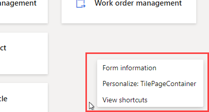
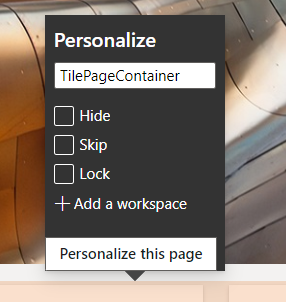
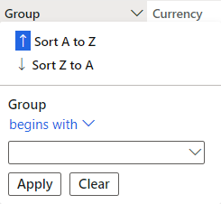
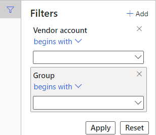
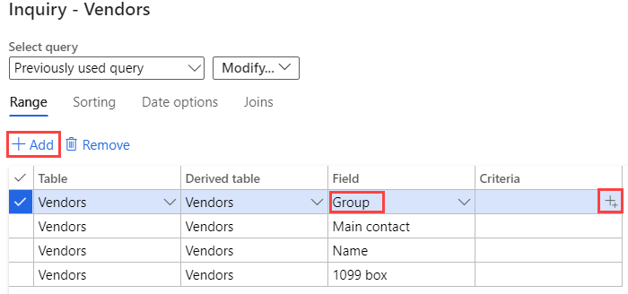

---
lab:
    title: '實驗室 2：探索工作區與篩選'
    module: '模組 1：學習 Microsoft Dynamics 365 Supply Chain Management 的基礎知識'
---

# 模組 1：學習 Microsoft Dynamics 365 Supply Chain Management 的基礎知識

## 實驗室 2 – 探索工作區和篩選

## 目標

首次登入 Finance and Operations 時，您可以使用許多內建的可用工作區。還可以建立自己的工作區，內容側重於您可能有的需求上。工作區是 Dynamics 365 的眾多功能之一，但是您還應該也發現，篩選是真正達到您在查找特定專案的方式。必須建立一個新的個人化工作區並使用篩選來識別您需要的不同項目。

## 實驗室設定

   - **估計時間**：10 分鐘

## 指示

1. 在 Finance and Operations 首頁的工作區磚右側，請按一下滑鼠右鍵或點選並按住空白區域以觸發功能表。

    

1. 在該功能表中，請選取**個人化：**

1. 在個人化視窗中，請選取 **+新增一個工作區**。

1. 如果個人化小視窗無法顯示，請嘗試在首頁上向上捲動並按一下滑鼠右鍵或點選並按住，然後選擇**個人化：**

    

1. 在首頁上，請向下捲動並找到新的**我的工作區 1** 磚。

    

1. 請按一下滑鼠右鍵或點選並按住該磚，然後選取**個人化：我的工作區 1**。

1. 在該個人化視窗中，請將我的工作區 1 重新命名為**我的工作區，**然後選取**個人化此頁面**。  
    變更後的名稱將自動儲存。

1. 在新打開的工具列中，請選擇**移動**。

    

1. 請選取**我的工作區**磚，然後將其移動至首頁上的另一個位置。

    >[!請注意]如果您無法移動該磚，請重新整理頁面並重試前面的步驟以移動該磚。

1. 關閉工具列。

1. 在首頁上的**搜尋一個頁面**方塊中，請搜尋並選取**所有供應商**。

1. 在所有供應商頁面的上層功能表，請選取**選項** > **新增至工作區**。

1. 在**工作區**篩選方塊中，請輸入**我的工作區，** 然後選取該工作空區。

1. 請選擇簡報功能表並檢閱可用選項，然後選取**磚**。

1. 完成後，請選取**設定**。

1. 在新增為磚窗格中驗證該磚名稱，然後選取**確定**。

1. 請在左側瀏覽窗格中，選取**首頁**圖示。

1. 在首頁上，請選取您的新工作區。

1. 在我的工作區頁面上，驗證是否顯示了新新增的供應商磚。

1. 請選取**供應商**磚。

1. 在所有供應商頁面上的**篩選**方塊中，請輸入**Contoso**。

1. 請檢閱可用於尋找 Contoso 的不同欄位。

    

1. 請選取**名稱：**

1. 請清除該篩選方塊，並按下「Enter」鍵以顯示所有供應商。

1. 請選取欄標題**群組**。

    

1. 您可以從低到高 (從 A 到 Z 排序) 或從高到低 (從 Z 到 A 排序) 來對群組進行排序。

1. 在**群組**下，請選取**開始於**功能表並檢閱比較運算子。請選取**完全符合**。

1. 請選取**完全符合**下方功能表，然後選取**其他供應商**。  
    或者，您可以在功能表欄位中輸入一個值。

1. 請選取**套用**並檢閱結果。請注意該群組欄位標頭中的篩選圖示。

    

1. 請選取**群組**欄位，然後在篩選功能表中選取**清除**。

1. 在所有供應商標題的左側，請選擇篩選圖示。

    

1. 請在篩選窗格的右上方選取 **+新增**。

1. 在篩選欄位窗格中，請選取**群組**左側的核取方塊，然後選擇更新。

1. 請注意其他篩選已新增。這將允許您根據多個條件來篩選清單。

    

1. 請在**供應商帳戶開頭為**篩選中，選取功能表，然後選取 **Northwind Traders**。

1. 請在**群組開頭為**篩選中，選取功能表，然後選取 **30**。

1. 請請選擇**套用**並檢閱篩選結果。

1. 請在篩選窗格中，選擇**重設**並注意附加其他篩選已被刪除並且預設過濾器已重設為空值。

1. 在功能區列上，請選擇**選項**，然後在頁面選項區段中選取**進階篩選或排序**。

    

1. 在查詢 –供應商視窗中，請選取 **+新增**。

1. 請在新列的欄位儲存格中，選擇功能表，然後選取**群組**。

1. 或者，您可以選擇該功能表，開始輸入群組的名稱，然後從篩選的結果中選取它。

1. 在條件儲存格中，請選取**開啟**圖示。

    

1. 在供應商群組清單中，請選其**30 其他供應商**。

1. 要儲存新查詢，請在**選取查詢**下選取**修改**功能表，然後選取**另存新檔**。

    

1. 請在儲存查詢窗格的**名稱**方塊中，輸入我的查詢，然後選取**確定**。

1. 在查詢 –供應商頁面上，請選取**確定**。

1. 驗證該清單是否反映了新建立的查詢。

1. 要移除篩選，請選取**進階或排序**，然後在查詢 – 供應商頁面上選取**重設**，並選擇**確定**。

1. 這將會重設查詢，但不會刪除您已儲存的查詢。
