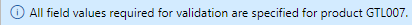

---
lab:
    title: '實驗室 3：建立一個具有多種尺寸和顏色的產品'
    module: '模組 1：學習 Microsoft Dynamics 365 Supply Chain Management 的基礎知識'
---

# 模組 1：學習 Microsoft Dynamics 365 Supply Chain Management 的基礎知識

## 實驗室 3 – 建立新產品

## 目標

在 Contoso Entertainment System USA (USMF) 中，您需要為要從供應商處購買的新設定機櫃建立一個新項目。

## 實驗室設定

   - **估計時間**： 10 分鐘

## 指示

1. 在 Finance and Operations 首頁的右上方，請確認您正在與 USMF 公司合作。

1. 如有必要，請選擇公司，然後從功能表中選取**USMF**。

1. 在左上方，請選取**展開瀏覽窗格**漢堡功能表。

1. 在瀏覽窗格中，請選取**模組** > **產品資訊管理**，然後在**產品**類別下選擇**已發行產品**。

1. 在已發行產品詳細資料頁面的頂上層功能表，請選取 **+新增**。

1. 在新發行的產品窗格中，請在**產品類型**功能表中，驗證已選取的**項目**。

1. 在**產品子類型**功能表中，請驗證已選取的**產品**。

1. 請選取**追蹤維度群組**功能表，然後選取**無**。

1. 在**識別**下的**產品編號**和**項目編號**方塊中，請輸入 **GTL007**。

1. 在**產品名稱**方塊中，請輸入**機櫃 2**。

1. 在**參考群組**下，請選擇**模型群組**功能表，然後選取**先進先出(FIFO)**。

1. 請選取**項目組合**功能表，然後選取**電視和視訊**。

1. 請選取**儲存維度群組**功能表，然後選取 **SiteWH**。

1. 在**量值單位**下，請驗證是否設定了以下值：

    | **設定**| **值**|
    | :--- | :--- |
    | 庫存單位| 每個|
    | 購買單位| 每個|
    | 銷售單位| 每個|
    | 位元順序標記 (BOM) 單位| 每個|

1. 在**銷售徵稅**下，請選取**項目銷售稅金群組**功能表，然後選取**全部**。

1. 在**購買徵稅**下，請選取**項目銷售稅金群組**功能表，然後選取**全部​​**。

1. 在價格下的購買價格方塊中，請輸入 30.00。

1. 在銷售價格方塊中，請輸入 30.00。

1. 您的新發行產品應如下所示：

    

1. 請選取**確定**。

1. 為確保產品最終確定，請在功能區列中的**維護**下，選取**驗證**。

    

1. 驗證您是否看到資訊橫幅，確認所有必要的欄位值都已驗證。

    

1. 請關閉所有頁面並返回首頁。
