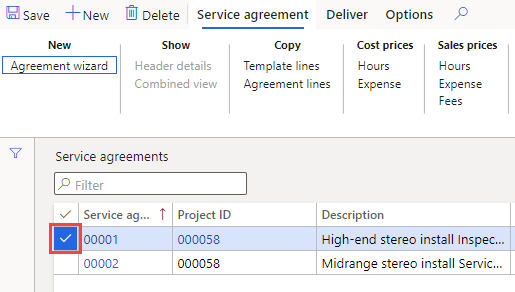
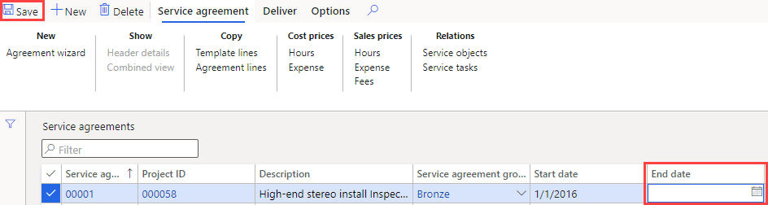

---
lab:
    title: '實驗室 7：建立計畫工單'
    module: '模組 1：學習 Microsoft Dynamics 365 Supply Chain Management 的基礎知識'
---

## 實驗室 7: 建立計畫工單

## 目標

放置在系統中的維護訂單描述資產所需的維護或修復，並用於指派適當的資源來完成維護請求。貴公司有一個持續的服務合約，需要確保已建立計畫服務訂單以支援合約項目的預期服務。

## 實驗室設定

   - **估計時間**：10 分鐘

## 指示

1. 在 Finance and Operations 首頁的右上方，請確認您正在與 USMF 公司合作。

1. 如有必要，請選取該公司，然後從功能表中選取 **USMF**。

1. 在左側瀏覽窗格中，請選取**模組** > **服務管理** > **服務合約** > **服務合約**。

1. 請選取第一個服務合約第一欄位中的核選方塊。

    

1. 請選取**結束日期**方塊並刪除目前的值，然後在上層功能表中選擇**儲存**。  
 正在刪除結束日期，以便可以為此合約建立一個新的服務訂單。

    

1. 請在上層功能表選擇**交付**。

1. 在功能區欄上的**建立**下，請選取**計畫服務訂單**。

1. 在建立服務訂單窗格的**期間**下，將**開始日期**設定為今天的日期，而將**結束日期**設定為距今天的兩天。

1. 在**資訊記錄檔**下，請選取**顯示資訊記錄檔**切換開關將其設定為**是**。  
這將顯示在合約中建立的服務訂單列表。

1. 在**包含交易類型**下，請選取**時數**切換開關將其設定為**是**。  
交易類型代表在服務合約中建立的明細，您選擇的每個交易類型都會產生數個服務訂單，其取決於服務合約明細上指定的服務間隔。

1. 在**選項**下，請選取**繼續**切換開關將其設定為**是**。  
這用於建從一個連續系列服務訂單中缺失的任何服務訂單。

1. 請選取**確定**。
