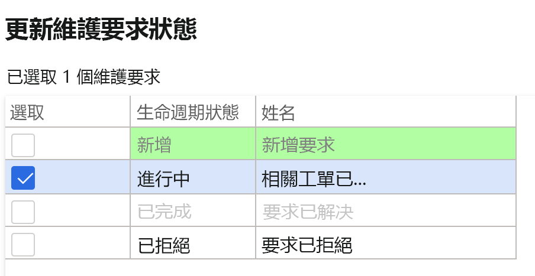
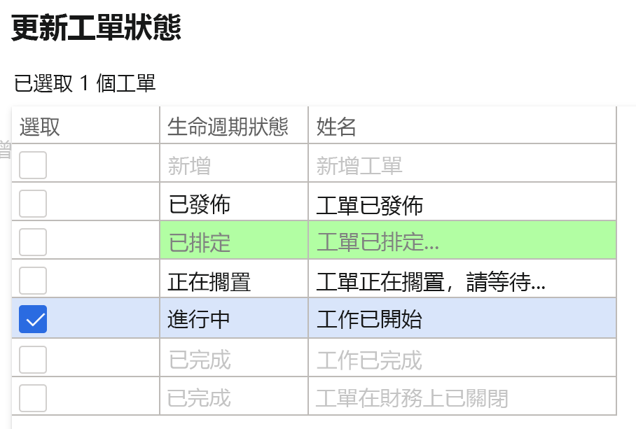
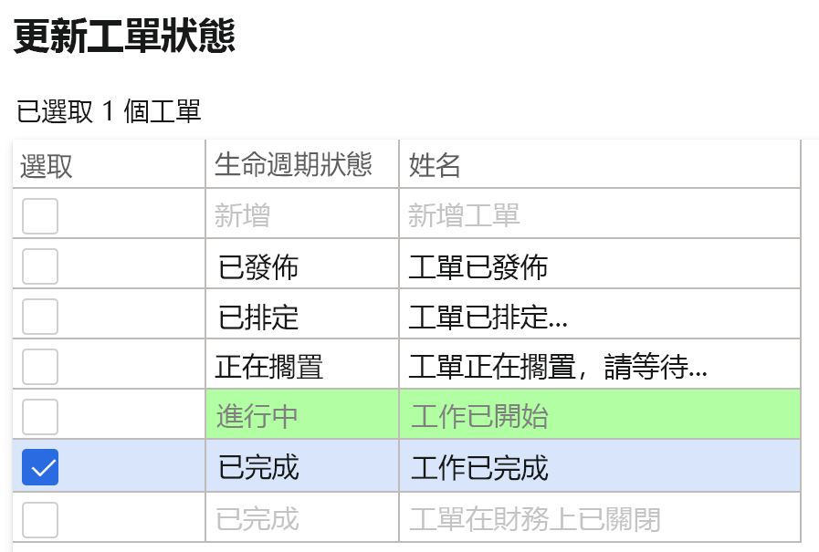

---
lab:
    title: '實驗室 7：建立維護工作單'
    module: '單元 1：學習 Microsoft Dynamics 365 Supply Chain Management 的基礎知識'
---

## 實驗室 7 - 建立維護工作單

**目標**

在系統中提出的維護單會描述資產所需的維護或維修作業，並用於指派適當的資源來完成維護請求。工作單是依據維護單來建立，並由所分配的資源來執行。

**實驗室設定**

預估時間：15 分鐘

**說明**

1. 在 Finance and Operations 首頁的右上方，請確認您正在與 USMF 公司合作。

2. 如有需要，請選擇公司，然後從功能表中選擇 **[USMF]**。

3. 在左側導覽窗格中，選擇 **[單元]** **&gt; [資產管理] &gt; [設定] &gt; [維護請求] &gt; [生命週期狀態]。**

4. 選擇 [InProgress]，然後按一下動作窗格中的 **[編輯]** 按鈕。

5. 在 **[一般]** 索引標籤中，將 **[建立工作單]** 的值變更為 [是]。

6. 在左側導覽窗格中，選擇 **[單元]** **&gt; [資產管理] &gt; [工作區] &gt; [維護請求管理]。**

7. 按一下 **[建立維護請求]**。

8. 在對話框的欄位中輸入以下值，然後按一下 **[確定]** 按鈕。

	- 維護請求類型：糾正性

	- 描述：金屬探測器中的雜訊

	- 功能位置：PP-02-02

	- 資產：MD-201

	- 服務層級：4

	- 故障症狀：雜訊過大

	- 故障範疇：電氣相關 

9. 關閉 **[維護請求]** 表單，並返回 **[維護請求管理]** 工作區。

10. 按一下畫面右上角的 **[重新整理]** 圖示，重新整理頁面。

11. 新的維護請求將會顯示在沒有工作單的維護請求清單中。

12. 請選擇新建立的維護請求，然後按一下 **[更新維護請求狀態]** 按鈕。 

13. 在對話框中勾選「InProgress」旁的核取方塊，然後按一下 **[確定]**。

 

14. 請選擇新建立的維護請求，然後按一下 **[建立工作單]** 按鈕。 

15. 在對話框的欄位中輸入以下值，然後按一下 **[確定]** 按鈕。

	- 維護工作類型：檢查

16. 系統將會建立新的工作單，且該工作單將會在所選擇的維護請求記錄中進行更新。

17. 按一下工作單，並前往 **[工作單詳細資料]** 畫面。

18. 在工作單 [明細] 下方，按一下 **[派發]** 按鈕。

19. 在對話框的欄位中輸入以下值，然後按一下 **[確定]** 按鈕。

	- 工作人員： Ted Howard

20. 在 [動作] 功能表中，前往 **[工作單] &gt; [生命週期狀態] &gt; [更新工作單狀態]**。

21. 在對話框中勾選「InProgress」旁的核取方塊，然後按一下 **[確定]**。

22. 在對話框中選擇 **[實際開始]** 日期與時間，然後按一下 **[確定]**。

23. 在 [工作單] 動作功能表中，再次前往 **[工作單 ]&gt; [生命週期狀態] &gt; [更新工作單狀態]**。

24. 在對話框中勾選「已完成」旁的核取方塊，然後按一下 **[確定]**。

25. 在 **[實際結束]** 欄位中，選擇一個晚於開始日期與時間的日期與時間，然後按一下 [確定]。

26. 您將會在工作單標題中看見目前的生命週期狀態顯示為已完成。
