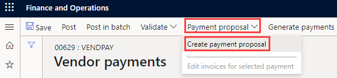

---
lab:
    title: '實驗室 2：建立供應商付款日誌'
    module: '模組 2：學習 Microsoft Dynamics 365 Finance 的基礎知識'
---

## 實驗室 2: 建立供應商付款日誌

## 目標

週期性向供應商付款的組織現在可以自動化產生廠商付款提案的程序。供應商付款提案自動化定義了以下詳細資料：

- 執行付款提案時
- 使用什麼條件來選擇應支付的發票
- 付款結果儲存在哪個供應商付款日誌中

付款提議自動化不會自動過帳付款。因此，您可以繼續使用目前用於核准已建立付款的任何驗證和工作流程。

建立新的供應商付款日誌項目和付款提案。

## 實驗室設定

   - **估計時間**：10 分鐘

## 說明

1. 在 Finance and Operations 首頁的右上方，請確認您正在與 USMF 公司合作。

1. 如有必要，請選擇公司，然後從功能表中選取 **USMF**。

1. 在左側瀏覽窗格中，請選取**模組** > **應付帳款** > **付款** > **供應商付款日誌**。

1. 在上層功能表，請選取 **+新增**。

1. 請注意新的日誌批號已建立。

1. 在**名稱**方塊中，請輸入**Vend,**，然後從已篩選的列表中選擇**VendPay**。

1. 請在上層功能表選取**行數**。

1. 在供應商付款頁面的上層功能表，請選擇**付款提案** > **建立付款提案**。  
    付款提案是用於選擇付款發票的查詢。可以在建立或產生供應商付款之前編輯要付款的發票清單。

    

1. 在供應商付款提案窗格中的**發票選取條件**下，選取**以選取發票**功能表，檢閱可用選項，然後選取**到期日**。

1. 在**開始日期**和**結束日期**中，請刪除所有現有值。對於本練習，這些日期範圍將留空。

    >[!請注意]最小付款日期可以用作付款日期。最小付款日期將是建立付款時所使用的最早日期。例如，如果發票的到期日在最小付款日期之後，則到期日將成為付款日期，而不是在支付發票可能的最晚日期的最小付款日期。

1. 請展開**記錄應包括**，然後檢閱選項。  
    篩選通常用於限制依供應商組合或付款方式選擇的付款發票。例如，您可以新增一個篩選，在這個執行中僅以支票來支付發票。

1. 請展開**進階參數**，然後檢閱可用選項。  
    其他參數可用於定義付款貨幣或為此支付執行來啟用集中式付款。

1. 請選取**確定**。  
    選取確定後，就會出現查詢的結果。如果不想預覽選取支付的發票列表，您可以返回到參數快速索引標籤並將設定**不使用預覽來建立付款**變更為**是**。

1. 在供應商付款提案視窗中，請選取**顯示付款概觀**以檢視將為所選發票上的供應商建立的付款。

    

1. 在功能表上，請選取**隱藏付款概觀**以隱藏該付款。

1. 請選取**供應商名稱**欄位標題左側的核取記號圖示來選擇所有發票。

    

1. 請清除前三張發票的核取方塊，然後在功能表上選擇**移除**以移除所有其他發票。

    

1. 在對話方塊中，請選取**是**。

1. 請檢閱剩餘的三張發票。

1. 要將發票列表匯出到 Excel，請在網格按一下滑鼠右鍵並選擇匯出選項。

1. 在右下角，請選擇**建立付款**以在付款日誌中建立供應商付款。

1. 請檢閱供應商付款清單。
